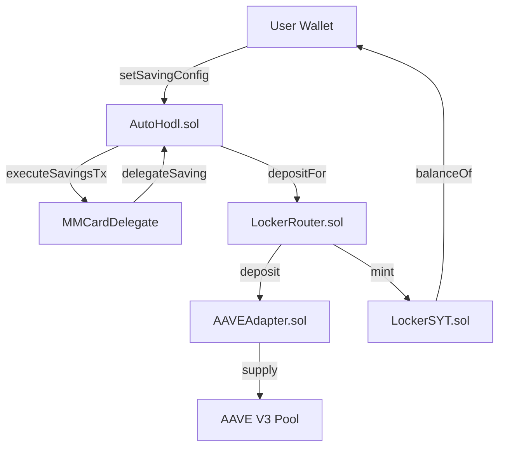

# 📦 `@autohodl.money/contracts`

This package contains the **smart contracts** that power the **autoHODL** protocol — enabling automated savings and yield generation on EVM chains.

---

## 📁 Project Structure

```
packages/contracts/
├── src/
│   ├── AutoHodl.sol              # Main savings automation contract
│   ├── delegates/
│   │   └── MMCardDelegate.sol    # Delegate contract for card-based savings
│   ├── interfaces/
│   │   ├── IDelegate.sol         # Delegate interface
│   │   ├── IERC20.sol            # ERC20 interface
│   │   ├── ILockerPool.sol       # Instant liquidity pool interface
│   │   ├── ILockerRouter.sol     # Router interface for deposits & settlements
│   │   └── IVenueAdapter.sol     # Yield venue adapter interface
│   └── yield/
│       ├── LockerRouter.sol      # Core router for yield allocation
│       ├── LockerSYT.sol         # Spendable Yield Token (SYT) implementation
│       └── adapters/
│           └── AAVEAdapter.sol   # AAVE V3 yield adapter
├── script/                       # Foundry deployment scripts
├── test/                         # Contract tests (Foundry)
├── lib/                          # External dependencies (forge libs)
├── foundry.toml                  # Foundry configuration
└── package.json
```

---

## 🧠 Architecture Overview



---

## 📦 Contract Breakdown

### 🔹 [AutoHodl.sol](./src/AutoHodl.sol)

The core savings automation contract. Manages:

- **Saving configurations** per user per token (round-up amount, delegate, yield routing)
- **Token allowlist** for supported assets
- **Delegate allowlist** for authorized automation providers
- **Savings execution** triggered by delegates

**Key Functions:**
- `setSavingConfig()` — User sets their savings preferences
- `setSavingConfigForUser()` — Delegate sets config on behalf of a user
- `executeSavingsTx()` — Delegate triggers a savings transaction

### 🔹 [LockerRouter.sol](./src/yield/LockerRouter.sol)

The yield routing engine that:

- Routes deposits across yield adapters based on allocation weights (bps)
- Mints SYT (Spendable Yield Tokens) to users
- Handles withdrawals and underlying asset transfers
- Manages per-asset allocation configurations

**Key Functions:**
- `deposit()` / `depositFor()` — Deposit assets and mint SYT
- `sendUnderlying()` — Redeem underlying for a user
- `setDefaultAlloc()` — Admin sets default yield allocation

### 🔹 [LockerSYT.sol](./src/yield/LockerSYT.sol)

**Spendable Yield Token** — an ERC20-compatible token representing a user's share of deposited assets. Features:

- **Rebasing-style balance** — `balanceOf()` returns current claim in underlying assets
- **Router-controlled minting/burning**
- **Transfer triggers underlying redemption** (spendable yield)

### 🔹 [AAVEAdapter.sol](./src/yield/adapters/AAVEAdapter.sol)

AAVE V3 venue adapter implementing `IVenueAdapter`:

- Deposits assets into AAVE lending pools
- Handles instant redemptions
- Tracks position value via aToken balances

### 🔹 [MMCardDelegate.sol](./src/delegates/MMCardDelegate.sol)

A delegate contract for card-based savings automation. Allows an authorized operator to trigger savings transactions on behalf of users.

---

## 🛠️ Getting Started

### Requirements

- [Foundry](https://book.getfoundry.sh/) (forge, cast, anvil)
- Node.js (>= 16.x) for TypeScript tooling
- `.env` file with RPC keys and private key for deployment

### Install Dependencies

```sh
cd packages/contracts
forge install
```

---

## 📘 Build

```sh
forge build
```

---

## 🧪 Testing

```sh
forge test
```

Run with verbosity for detailed output:

```sh
forge test -vvv
```

---

## 📝 Formatting

Format Solidity files:

```sh
forge fmt
```

---

## 🚀 Deployment

### Deploy AutoHodl Contract

```sh
forge script script/DeployAutoHodl.s.sol:DeployAutoHodl \
  --rpc-url <your_rpc_url> \
  --private-key <your_private_key> \
  --broadcast \
  --etherscan-api-key <your_etherscan_api_key> \
  --verify
```

### Deploy MMCardDelegate Contract

```sh
forge script script/DeployDelegate.s.sol:DeployDelegate \
  --rpc-url <your_rpc_url> \
  --private-key <your_private_key> \
  --broadcast \
  --etherscan-api-key <your_etherscan_api_key> \
  --verify
```

### Deploy LockerRouter

```sh
forge script script/LockerRouter.s.sol:LockerRouterScript \
  --rpc-url <your_rpc_url> \
  --private-key <your_private_key> \
  --broadcast \
  --etherscan-api-key <your_etherscan_api_key> \
  --verify
```

### Setup Adapter

```sh
forge script script/SetupAdapter.s.sol:SetupAdapterScript \
  --rpc-url <your_rpc_url> \
  --private-key <your_private_key> \
  --broadcast \
  --etherscan-api-key <your_etherscan_api_key> \
  --verify
```

---

## 📁 Deployment Scripts

| Script | Description |
|--------|-------------|
| `DeployAutoHodl.s.sol` | Deploys the main AutoHodl contract |
| `DeployDelegate.s.sol` | Deploys and verifies MMCardDelegate |
| `LockerRouter.s.sol` | Deploys the LockerRouter |
| `SetupAdapter.s.sol` | Sets up yield adapter configuration |
| `SetupSYT.s.sol` | Sets up SYT token for an asset |
| `Deposit.s.sol` | Test deposit script |

---

## 🧩 Integration

This contract package integrates with:

- **Frontend Application**: The [Web Dashboard](../../apps/web) provides the primary user interface and manages environment-specific contract configurations.

---

## 📜 License

UNLICENSED

---